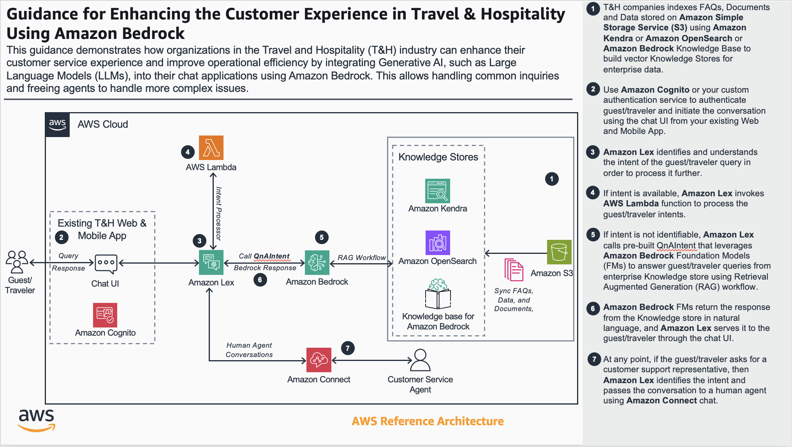

# Using Lex QnAIntent to support natural language conversations

This solution will explore how to integrate Amazon Lex chat bots with Amazon Bedrock Knowledge Bases through the Lex QnAIntent feature, allowing natural language conversations with your knowledge repositories.

## Table of Content 

1. [Overview](#overview)
    - [Cost](#cost)
2. [Prerequisites](#prerequisites)
3. [Deployment Steps](#deployment-steps)
4. [Deployment Validation](#deployment-validation)
5. [Running the Guidance](#running-the-guidance)
6. [Cleanup](#cleanup)
7. [Additional Considerations](#additional-considerations)
8. [Revisions](#revisions)
9. [Notices](#notices)
10. [Authors](#authors)

## Overview

1. Amazon Bedrock Knowledge Bases allow customers to create embeddings of their knowledge repositories in Amazon S3 using OpenSearch Serverless and Amazon Bedrock, store those embeddings in a vector database, and interact with that knowledge repositories via Amazon Bedrock Knowledge Bases and Amazon Lex.

This solution provides the steps to create the necessary resources via CloudFormation custom resources until native support for Lex QnAIntent in CloudFormation is available.  The solution and CloudFormation template will be updated at that time.  

### Architecture Diagram

 

### Cost

You are responsible for the cost of the AWS services used while running this Guidance. As of May 2024, the cost for running this Guidance with the default settings in the <us-east-1 AWS Region> is approximately $182.28 per month.

_We recommend creating a [Budget](https://docs.aws.amazon.com/cost-management/latest/userguide/budgets-managing-costs.html) through [AWS Cost Explorer](https://aws.amazon.com/aws-cost-management/aws-cost-explorer/) to help manage costs. Prices are subject to change. For full details, refer to the pricing webpage for each AWS service used in this Guidance._

### Sample Cost Table

The following table provides a sample cost breakdown for deploying this Guidance with the default parameters in the US East (N. Virginia) Region for one month.  To prevent total charges 

| AWS service  | Dimensions | Cost [USD] |
| ----------- | ------------ | ------------ |
| AWS CloudFormation | No additional charge for resources in the AWS::* namespace  | $ 0.00 |
| Amazon Lex | 1,000 text requests per month x 0.00075 USD | $ 0.75 |
| Amazon S3 | 1 GB object storage x 0.023 USD | $ 0.02 |
| Amazon Bedrock | 1,000 Invoke Model Requests - Claude V2 (500 input tokens, 100 output tokens) | $ 6.30 |
| Amazon OpenSearch | 2 OCUs Indexing - 2 OCUs Search and Query | $ 175.21 |

*OpenSearch Serverless minimum configurations is 2 OCUs for Indexing and 2 OCUs for Search and Query.  OpenSearch Serverless can scale down to 0.5 OCUs.  The estimate above is assuming fractional OCUs.  If using the full minimum configuration settings of 2 OCUs for Indexing and 2 OCUs for Search and Query, the cost would be $700.82 per month.*

## Prerequisites 

Follow the steps to [Create a knowledge base](https://docs.aws.amazon.com/bedrock/latest/userguide/knowledge-base-create.html).  Note the Bedrock Knowledge Base ID; you will need this information in the deployment steps.

### AWS account requirements

Ensure you have enabled access to the Amazon Bedrock Models you wish to use in this guidance.  Steps to enable model access can be found in the [Amazon Bedrock documentation](https://docs.aws.amazon.com/bedrock/latest/userguide/model-access.html).  

**Resources**
- AWS CloudFormation
- Amazon Lex
- Amazon S3 bucket
- Amazon Bedrock Knowledge Bases
- Amazon OpenSearch Serverless Collection

## Deployment Steps 

1. Clone the repo using command ```git clone https://github.com/aws-solutions-library-samples/guidance-for-enhancing-the-customer-experience-for-travel-and-hospitality-using-amazon-bedrock.git```
2. cd to the repo folder ```cd guidance-for-enhancing-the-customer-experience-for-travel-and-hospitality-using-amazon-bedrock/guidance/lex-qnaintent-bedrock/deployment```
3. Your AWS CloudFormation template will be available in this directory.  
4. Navigate to AWS CloudFormation in the AWS Console.
5. Select Create stack - With new resources (standard).
6. Upload the template file in the deployment directory you examined.
7. Enter a unique Stack name.
8. For your kbarn parameter, enter the Bedrock Knowledge Base ID you created in the prerequisites section.
9. For your modelarn parameter, enter the Bedrock Model ID you would like to use.  For this guidance, at this time we recommend entering ```anthropic.claude-v2```.  Additional Bedrock Model IDs can be found in the [documentation](https://docs.aws.amazon.com/bedrock/latest/userguide/model-ids.html).
10. Click Next
11. On the Configure stack options section, leave all inputs as default and click Next.
12. On the Review and create section, scroll down to the bottom and check the option for ```I acknowledge that AWS CloudFormation might create IAM resources```.  Click Submit.


## Deployment Validation

It will take a few minutes for your stack to deploy.  Once you receive a ```CREATE_COMPLETE``` status message, navigate to Amazon Lex in the AWS Console to test your Lex bot with QnAIntent.


## Running the Guidance 

1. After navigating to Amazon Lex in the AWS Console, click the bot deployed by the solution. 
2. Next, navigate to English (US) in the left side menu under All languages.  
3. You should now see an option to **Build** or **Test** your bot in the upper right corner of the console.  Click **Build**.
4. After the build is complete, you can now test your bot.  Click **Test** and a test window should appear in the right side of the screen. 
5. Interact with your bot by asking questions about your knowledge repository.


## Cleanup 

1. Delete your CloudFormation stack by navigating to AWS CloudFormation in the AWS Console.  
2. Select the stack you deployed previously.
3. Click Delete in the upper right corner, then click Delete in the pop up modal window.
4. Next, navigate to Amazon Bedrock in the AWS Console to delete your Bedrock Knowledge Base.
5. Navigate to Bedrock Knowledge Bases.
6. Click the radio button next to the Bedrock Knowledge Base you created earlier, and click Delete.  
7. In the modal window, check **Delete underlying vector data**, then type Delete in the textbox.  Then click Delete.
8. After your Bedrock Knowledge Base and vector data is deleted, navigate to Amazon S3 in the AWS Console.
9. Select the radio button next to the S3 Bucket used for your knowledge base repository, and click the **Empty** button if you no longer need this data.
10. After the bucket data is removed, you can now select **Delete** to delete your bucket.

## Additional Considerations

Amazon Cognito is an identity platform for web and mobile apps. It’s a user directory, an authentication server, and an authorization service for OAuth 2.0 access tokens and AWS credentials. With Amazon Cognito, you can authenticate and authorize users from the built-in user directory, from your enterprise directory, and from consumer identity providers like Google and Facebook.

[More information on how to integrate Amazon Cognito with this solution can be found here.](https://docs.aws.amazon.com/cognito/latest/developerguide/cognito-integrate-apps.html)

Amazon Lex QnAIntent can be integrated with Amazon Bedrock Knowledge Bases, as demonstrated in this solution guidance.  It can also be integrated with Amazon Kendra or Amazon OpenSearch.  [More information on integrating with these additional knowledge store options can be found here.](https://docs.aws.amazon.com/lexv2/latest/dg/built-in-intent-qna.html)

Amazon Connect is an omnichannel cloud contact center. You can set up a contact center in a few steps, add agents located anywhere, and start engaging with your customers.  [To integrate an Amazon Lex bot with Amazon Connect, please see the steps here.](https://docs.aws.amazon.com/connect/latest/adminguide/amazon-lex.html)

## Revisions

May 28, 2024 - Initial Commit

## Notices

*Customers are responsible for making their own independent assessment of the information in this Guidance. This Guidance: (a) is for informational purposes only, (b) represents AWS current product offerings and practices, which are subject to change without notice, and (c) does not create any commitments or assurances from AWS and its affiliates, suppliers or licensors. AWS products or services are provided “as is” without warranties, representations, or conditions of any kind, whether express or implied. AWS responsibilities and liabilities to its customers are controlled by AWS agreements, and this Guidance is not part of, nor does it modify, any agreement between AWS and its customers.*


## Authors

- Josh Rodgers
- Atik Khatri
