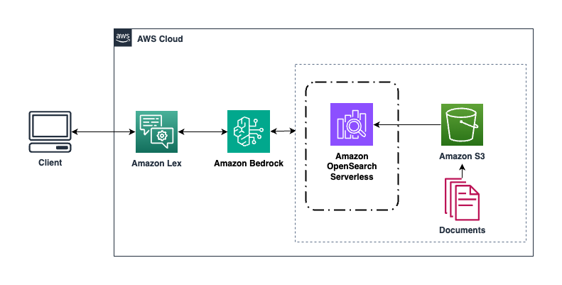

# Using Lex QnAIntent to support natural language conversations

This solution will explore how to integrate Amazon Lex chat bots with Amazon Bedrock Knowledge Bases through the Lex QnAIntent feature, allowing natural language conversations with your knowledge repositories.

## Table of Content 

1. [Overview](#Overview)
    - [Cost](#Cost)
2. [Prerequisites](#Prerequisites)
3. [Deployment Steps](#deployment-steps-required)
4. [Deployment Validation](#deployment-validation-required)
5. [Running the Guidance](#running-the-guidance-required)
6. [Next Steps](#next-steps-required)
7. [Cleanup](#cleanup-required)
8. [FAQ, known issues, additional considerations, and limitations](#faq-known-issues-additional-considerations-and-limitations-optional)
9. [Revisions](#revisions-optional)
10. [Notices](#notices-optional)
11. [Authors](#authors-optional)

## Overview

1. Amazon Bedrock Knowledge Bases allow customers to create embeddings of their knowledge repositories in Amazon S3 using OpenSearch Serverless and Amazon Bedrock, store those embeddings in a vector database, and interact with that knowledge repositories via Amazon Bedrock Knowledge Bases and Amazon Lex.

This solution provides the steps to create the necessary resources via CloudFormation custom resources until native support for Lex QnAIntent in CloudFormation is available.  The solution and CloudFormation template will be updated at that time.  

### Architecture Diagram

 

### Cost

_You are responsible for the cost of the AWS services used while running this Guidance. As of May 2024, the cost for running this Guidance with the default settings in the <us-east-1 AWS Region> is approximately $<n.nn> per month for processing ( <nnnnn> records )

_We recommend creating a [Budget](https://docs.aws.amazon.com/cost-management/latest/userguide/budgets-managing-costs.html) through [AWS Cost Explorer](https://aws.amazon.com/aws-cost-management/aws-cost-explorer/) to help manage costs. Prices are subject to change. For full details, refer to the pricing webpage for each AWS service used in this Guidance._

### Sample Cost Table

The following table provides a sample cost breakdown for deploying this Guidance with the default parameters in the US East (N. Virginia) Region for one month.

| AWS service  | Dimensions | Cost [USD] |
| ----------- | ------------ | ------------ |
| Amazon API Gateway | 1,000,000 REST API calls per month  | $ 3.50month |
| Amazon Cognito | 1,000 active users per month without advanced security feature | $ 0.00 |

## Prerequisites 

Follow the steps to [Create a knowledge base](https://docs.aws.amazon.com/bedrock/latest/userguide/knowledge-base-create.html).  Note the Bedrock Knowledge Base ID; you will need this information in the deployment steps.

### AWS account requirements

Ensure you have enabled access to the Amazon Bedrock Models you wish to use in this guidance.  Steps to enable model access can be found in the [Amazon Bedrock documentation](https://docs.aws.amazon.com/bedrock/latest/userguide/model-access.html).  

**Resources**
- AWS CloudFormation
- Amazon Lex
- S3 bucket
- Amazon Bedrock Knowledge Bases
- Amazon OpenSearch Serverless Collection

## Deployment Steps 

1. Clone the repo using command ```git clone https://github.com/aws-solutions-library-samples/guidance-for-enhancing-the-customer-experience-for-travel-and-hospitality-using-amazon-bedrock.git```
2. cd to the repo folder ```cd guidance-for-enhancing-the-customer-experience-for-travel-and-hospitality-using-amazon-bedrock/source/lex-qnaintent-bedrock/deployment```
3. Your AWS CloudFormation template will be available in this directory.  
4. Navigate to AWS CloudFormation in the AWS Console.
5. Select Create stack - With new resources (standard).
6. Upload the template file in the deployment directory you examined.
7. Enter a unique Stack name.
8. For your kbarn parameter, enter the Bedrock Knowledge Base ID you created in the prerequisites section.
9. For your modelarn parameter, enter the Bedrock Model ID you would like to use.  For this guidance, at this time we recommend entering ```anthropic.claude-v2```.  Additional Bedrock Model IDs can be found in the [documentation](https://docs.aws.amazon.com/bedrock/latest/userguide/model-ids.html).
10. Click Next
11. On the Configure stack options section, leave all inputs as default and click Next.
12. On the Review and create section, scroll down to the bottom and check the option for ```I acknowledge that AWS CloudFormation might create IAM resources```.  Click Submit.


## Deployment Validation

It will take a few minutes for your stack to deploy.  Once you receive a CREATE_COMPLETE status message, navigate to Amazon Lex in the AWS Console to test your Lex bot with QnAIntent.


## Running the Guidance 

<Provide instructions to run the Guidance with the sample data or input provided, and interpret the output received.> 

This section should include:

* Guidance inputs
* Commands to run
* Expected output (provide screenshot if possible)
* Output description


## Cleanup 

- Include detailed instructions, commands, and console actions to delete the deployed Guidance.
- If the Guidance requires manual deletion of resources, such as the content of an S3 bucket, please specify.

## Revisions

Document all notable changes to this project.

Consider formatting this section based on Keep a Changelog, and adhering to Semantic Versioning.

## Notices

*Customers are responsible for making their own independent assessment of the information in this Guidance. This Guidance: (a) is for informational purposes only, (b) represents AWS current product offerings and practices, which are subject to change without notice, and (c) does not create any commitments or assurances from AWS and its affiliates, suppliers or licensors. AWS products or services are provided “as is” without warranties, representations, or conditions of any kind, whether express or implied. AWS responsibilities and liabilities to its customers are controlled by AWS agreements, and this Guidance is not part of, nor does it modify, any agreement between AWS and its customers.*


## Authors

Josh Rodgers
Atik Khatri
